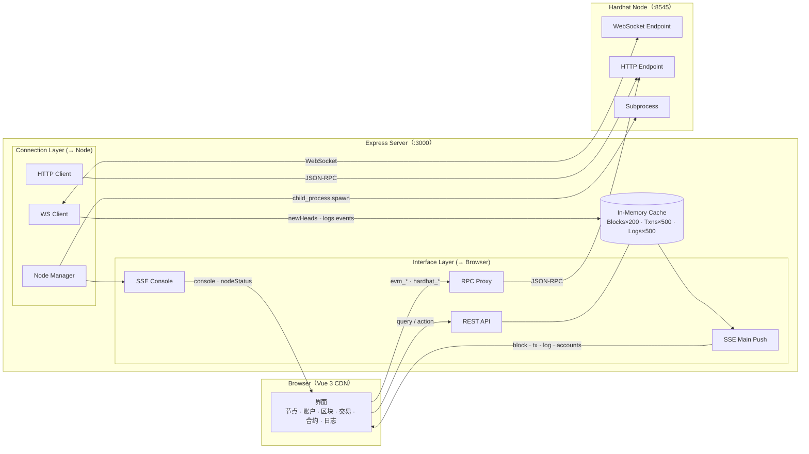
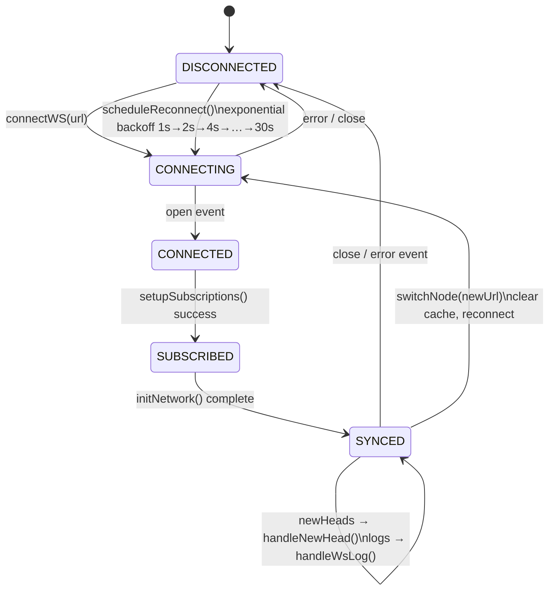
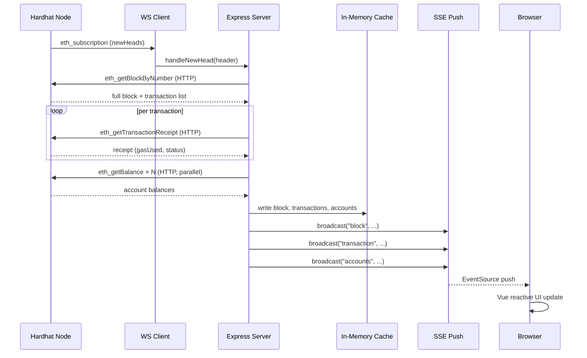

# Hardhat GUI

[中文](README.md) | **English**

A browser-based visual management interface for Hardhat local nodes — a modern, actively maintained alternative to the discontinued Ganache, with a fully bilingual (Chinese/English) UI.

> Hardhat is bundled. No external project required, no build tools needed — one command to start.

---

## Why Hardhat GUI?

### Ganache / Truffle Are History

Ganache was the go-to GUI for Ethereum local development, letting developers manage accounts, inspect blocks, and debug transactions without touching the command line. However, **Truffle Suite (including Ganache) officially announced end-of-life in September 2023**. The last Ganache release shipped in 2022; it no longer receives security fixes or Node.js compatibility updates and fails to run in modern environments.

### Hardhat Is Powerful — But CLI-Only

Hardhat is today's most actively maintained Ethereum development framework, featuring a local node built on a Rust/EDR core, powerful debugging tools, and a rich plugin ecosystem. Yet **Hardhat has never shipped a GUI** — all operations go through the terminal, with blocks, transactions, and account state scattered across log output. This creates a real barrier for developers migrating from Ganache, for classroom settings, or for demonstrating blockchain behavior to non-technical audiences.

### Limitations of Existing Alternatives

| Tool | Issue |
|------|-------|
| Ganache Desktop | Unmaintained; Node.js incompatibility; no Hardhat v3 support |
| Ganache CLI | Archived; no longer updated |
| Otterscan | Requires separate deployment; limited local-node support |
| Remix IDE | No local node management; no full transaction history |
| Blockscout | Complex infrastructure; high local-deployment cost |

### What Hardhat GUI Offers

A **lightweight, purpose-built visual interface for Hardhat local nodes**:

- Runs in any browser — no desktop app to install
- Bundled Hardhat — one command sets up the entire environment
- Real-time visibility into accounts, blocks, transactions, contracts, and on-chain logs
- Advanced debugging: mainnet fork, state snapshots, time travel
- Bilingual UI (Chinese / English) switchable at runtime

---

## Feature Overview

| Tab | Key Features |
|-----|-------------|
| **Node** | Start / stop Hardhat node in the GUI; configure port, Chain ID, accounts, mnemonic, fork; live console output |
| **Accounts** | Address, ETH balance, nonce; expand to reveal / copy private key |
| **Blocks** | Real-time new-block append; expand to see all transactions in a block |
| **Transactions** | Full transaction history; expand for input data, gas details, contract creation address |
| **Contracts** | Auto-scan `artifacts/` directory; display full ABI structure |
| **Logs** | Real-time on-chain event logs via WebSocket subscription |

Toolbar: mine block, automine toggle, time advance, network snapshot & revert.

---

## Requirements

| Dependency | Version |
|------------|---------|
| Node.js | >= 22.4.0 (built-in `fetch` and `WebSocket`) |

Hardhat is included as a dependency — no separate installation needed.

---

## Quick Start

```bash
# 1. Install dependencies
npm install

# 2. Start the GUI server
npm start

# 3. Open in browser
# http://localhost:3000
```

After opening the page, switch to the **Node** tab and click **▶ Start Node**.

---

## Directory Structure

```
hardhat-gui/
├── server.js            # Express backend (WS + SSE + REST API)
├── package.json
├── node-workspace/      # Runtime-generated (gitignored)
│   ├── package.json     # { "type": "module" }
│   └── hardhat.config.js  # Dynamically generated from GUI config
└── public/
    ├── index.html       # Single-page app entry (Vue 3 CDN)
    ├── app.js           # Vue 3 application logic + i18n
    └── style.css        # Dark theme styles
```

---

## Environment Variables

| Variable | Default | Description |
|----------|---------|-------------|
| `PORT` | `3000` | GUI server port |
| `RPC_URL` | `http://127.0.0.1:8545` | Node address to connect on startup |
| `ARTIFACTS_DIR` | `../dapp/artifacts` | Contract artifacts scan directory |

```bash
# Connect to an existing external node
RPC_URL=http://127.0.0.1:8546 npm start

# Specify a custom artifacts directory
ARTIFACTS_DIR=/path/to/project/artifacts npm start
```

---

## Feature Details

### Node Management

The GUI provides full lifecycle management — no manual terminal operations required.

**Basic configuration:**

| Field | Description |
|-------|-------------|
| Hardhat Project Directory | Leave blank for built-in Hardhat; enter a path to load artifacts from an external project |
| Port | Default: 8545 |
| Hostname | Default: 127.0.0.1 |
| Chain ID | Default: 31337 |

**Account settings (collapsible):**

| Field | Description |
|-------|-------------|
| Account Count | Default: 20 |
| Initial Balance | In ETH; default: 10000 |
| Mnemonic | Default Hardhat mnemonic |

**Fork settings (collapsible):**

| Field | Description |
|-------|-------------|
| Fork RPC URL | Forks the specified chain (e.g. Mainnet, Sepolia) when provided |
| Fork Block Number | Leave blank to fork the latest block |

After startup, the right panel streams live stdout/stderr output; the left panel displays parsed account addresses and private keys.

**Implementation:**

- Hardhat node is launched via `child_process.spawn`
- `node-workspace/hardhat.config.js` is dynamically generated (plain ESM object export, no imports)
- On Windows, the process tree is cleaned up via `taskkill /F /T /PID`

### Accounts

- Lists all node accounts; balance and nonce auto-refresh after each new block
- Click any row to expand and reveal / hide the private key
- Private keys for the 20 default Hardhat accounts (standard mnemonic) are pre-matched; custom accounts show "private key unknown"
- One-click copy for address and private key

### Blocks

- Displayed in reverse chronological order; new blocks appended in real time via WebSocket (latency < 10 ms)
- Each row: block number, timestamp, tx count, gas used / limit, block hash
- Expand: parent hash, miner address, all transactions in the block
- Paginated history browsing

### Transactions

- Records all transactions; pushed to the frontend in real time after each new block
- Each row: tx hash, block number, from, to, value, gas used, status
- Expand: full fields (gas price, nonce, contract creation address, raw input data)
- Paginated browsing

### Contracts

- Auto-scans the configured `artifacts` directory; identifies all compiled contracts (skips `build-info` and `.dbg.json`)
- Left panel: contract name, member count, bytecode size
- Right panel: full ABI — function signatures, parameter types, visibility, return types
- Enter a deployed address for quick reference
- Custom scan directory supported

**ABI member types:**

| Tag | Meaning |
|-----|---------|
| function | Regular function |
| event | Event |
| constructor | Constructor |
| receive | Receive ETH function |
| fallback | Fallback function |
| error | Custom error |

### Logs

- Receives on-chain events directly via `eth_subscribe("logs", {})` — no receipt traversal
- Each entry: block number, contract address, source tx hash, topics list, data
- Manual clear supported

### Toolbar

| Control | RPC Method | Description |
|---------|-----------|-------------|
| ⛏ Mine | `evm_mine` | Mine an empty block immediately |
| Automine | `evm_setAutomine` | Mine a block for every transaction |
| 📸 Snapshot | `evm_snapshot` / `evm_revert` | Save / revert chain state |
| ⏩ Time | `evm_increaseTime` | Advance the block timestamp |

---

## Architecture

### System Architecture



### WebSocket State Machine



### New Block Data Flow



**Backend connection layer (WS):**

| Function | Responsibility |
|----------|---------------|
| `connectWS(url)` | Open connection, register message / close / error handlers |
| `setupSubscriptions()` | Subscribe to `newHeads` + `logs`; call `initNetwork()` on success |
| `initNetwork()` | Fetch chainId / accounts / catch-up blocks via HTTP; broadcast initial state |
| `handleNewHead(header)` | New block header → HTTP fetch full block → broadcast |
| `handleWsLog(log)` | Log received → deduplicate → broadcast |
| `scheduleReconnect()` | Exponential backoff (1→2→4→…→30s) |
| `switchNode(httpUrl)` | Switch node: clear cache + rebuild WS connection |

**Special operation handling:**

| Operation | Approach |
|-----------|---------|
| `evm_mine` | Handled automatically by WS `newHeads` |
| `evm_revert` | No WS event; manually clear cache then call `initNetwork()` |
| `hardhat_reset` | Clear cache then call `initNetwork()`; WS subscriptions remain valid |
| Node switch | `switchNode()` cancels reconnect timer, clears cache, opens new WS connection |

**In-memory cache limits:**

| Type | Limit |
|------|-------|
| Blocks | 200 |
| Transactions | 500 |
| Event logs | 500 |

---

## Supported RPC Methods

The toolbar proxies the following Hardhat-specific methods via a whitelist:

| Method | Purpose |
|--------|---------|
| `evm_mine` | Mine a block manually |
| `evm_setAutomine` | Enable / disable automine |
| `evm_setIntervalMining` | Set fixed block interval (ms) |
| `evm_increaseTime` | Advance time (seconds) |
| `evm_setNextBlockTimestamp` | Set exact timestamp for next block |
| `evm_snapshot` | Create a chain state snapshot |
| `evm_revert` | Revert to a snapshot |
| `hardhat_reset` | Reset network to initial state |
| `hardhat_getAutomine` | Query current automine status |
| `hardhat_setBalance` | Set account balance |
| `hardhat_impersonateAccount` | Impersonate an account |

---

## Development Mode

```bash
npm run dev   # Node.js --watch; auto-restarts on server.js changes
```

---

## FAQ

**Q: The page shows "Disconnected" and no built-in node is running?**

Switch to the **Node** tab and click **▶ Start Node**. To connect an existing external node, use the environment variable:

```bash
RPC_URL=http://127.0.0.1:8545 npm start
```

---

**Q: Node startup fails with console errors?**

Common causes:
- Port already in use → change the port in **Node Configuration**
- `node-workspace/` permission issue → ensure the current user has write access to the project directory

---

**Q: No contracts showing in the Contracts tab?**

Compile your Hardhat project first:

```bash
npx hardhat compile
```

Then enter the absolute path to the `artifacts` directory in the Contracts tab and click **Scan**.

---

**Q: Accounts show "private key unknown"?**

The GUI only auto-matches private keys for the Hardhat default mnemonic (`test test test test test test test test test test test junk`). For custom mnemonics, private keys are visible in the Node tab console output.

---

**Q: Data not updating after snapshot revert?**

The revert operation automatically triggers `initNetwork()` to re-sync. If issues persist, manually refresh the browser page.

---

**Q: How do I connect to Anvil (Foundry)?**

Anvil is JSON-RPC compatible with Hardhat, including WS subscriptions:

```bash
RPC_URL=http://127.0.0.1:8545 npm start
```

---

**Q: Can I use a Node.js version below 22.4.0?**

The built-in `WebSocket` requires Node.js >= 22.4.0. For older versions, install the `ws` package and update the WS initialization in `server.js`; the rest of the logic is unchanged.

---

## Notes

- This tool is intended for **local development and education only** — do not connect to public networks or mainnet nodes
- Account private keys are publicly known Hardhat test keys — **never use them to store real assets**
- All data is stored in memory; history is cleared when the GUI server restarts
- The `node-workspace/` directory is managed automatically — do not edit its contents manually
