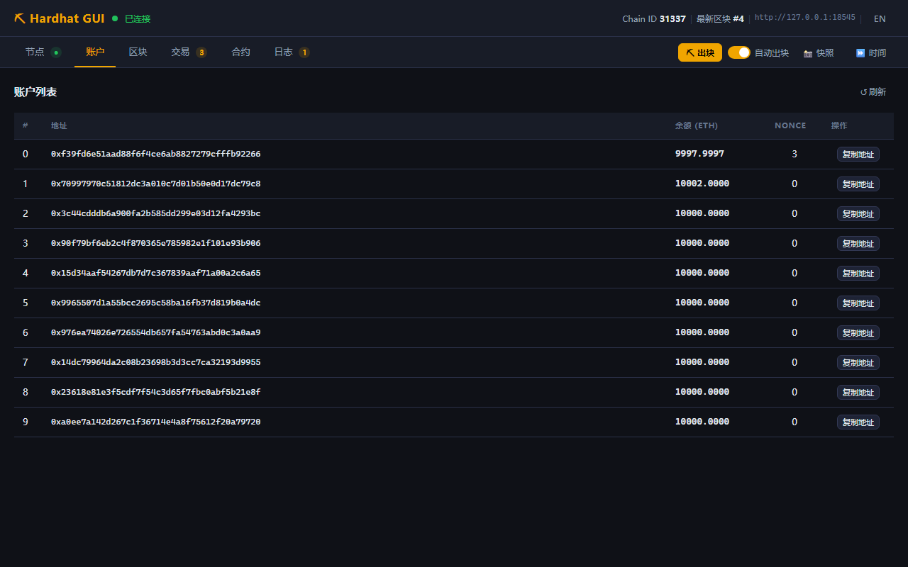
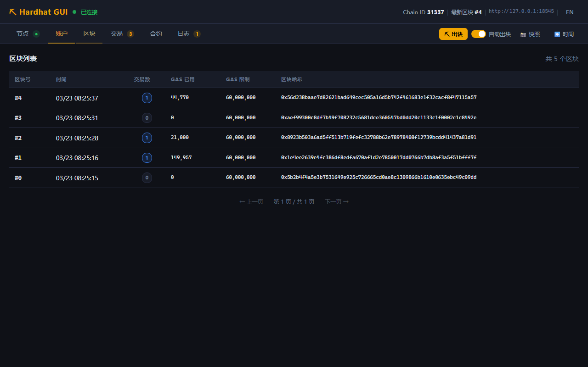
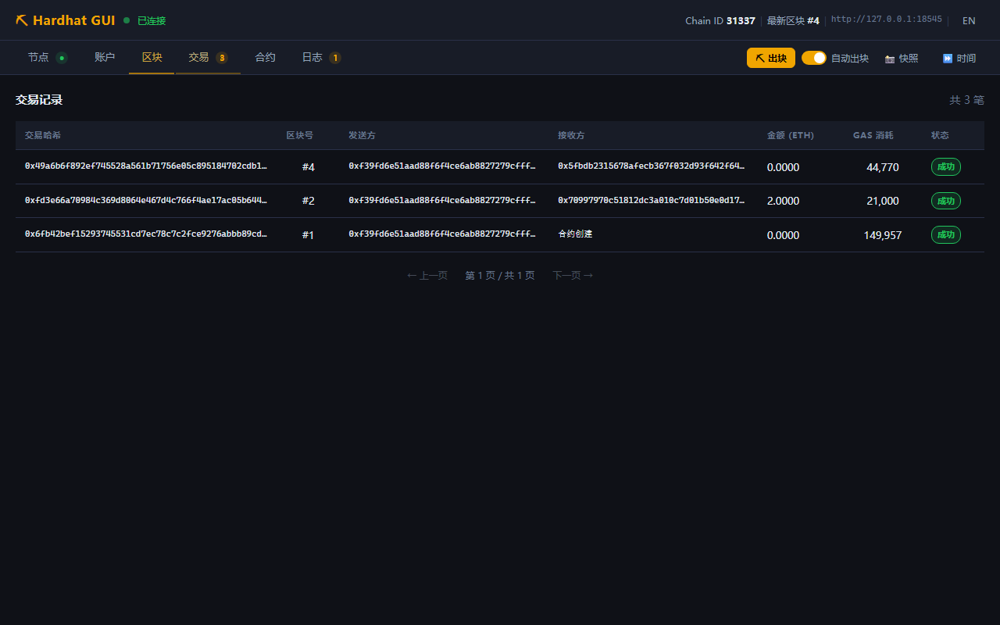
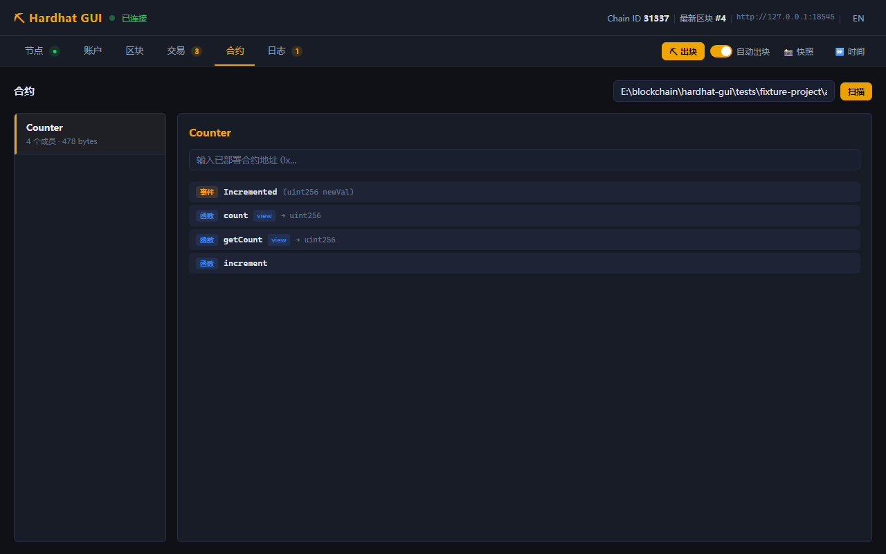
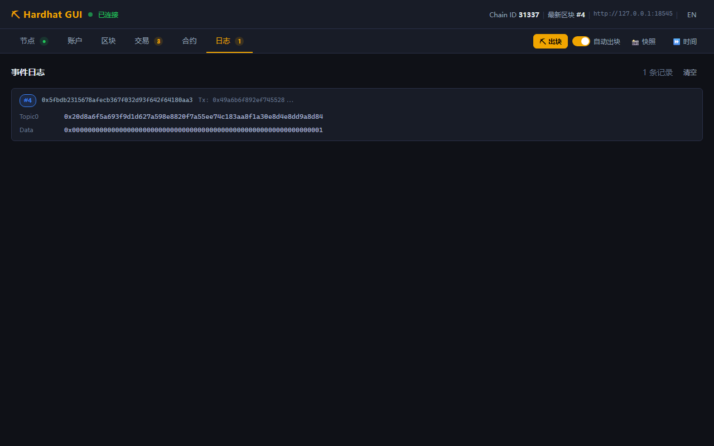
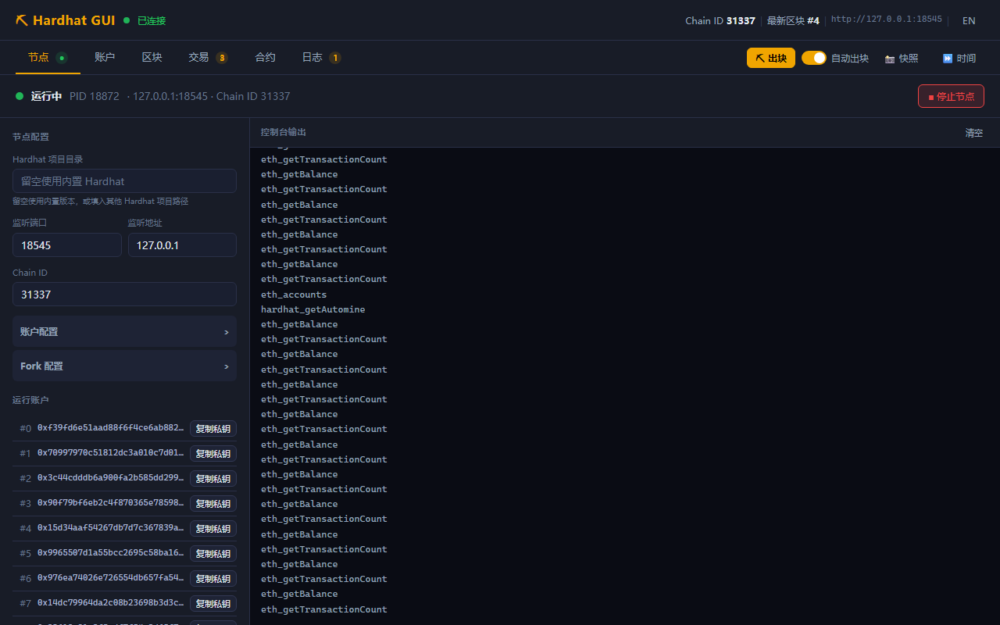
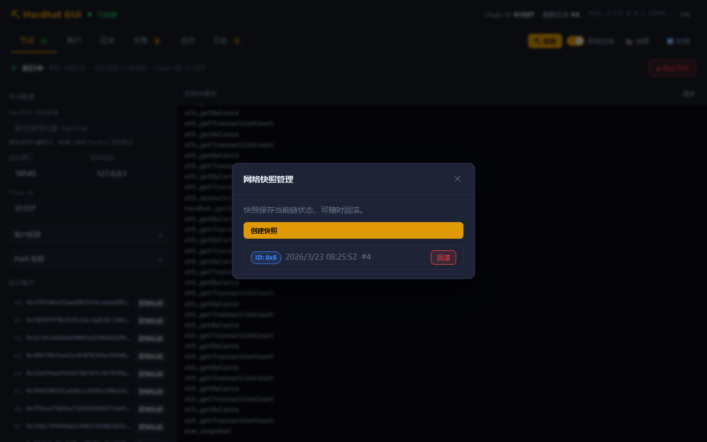
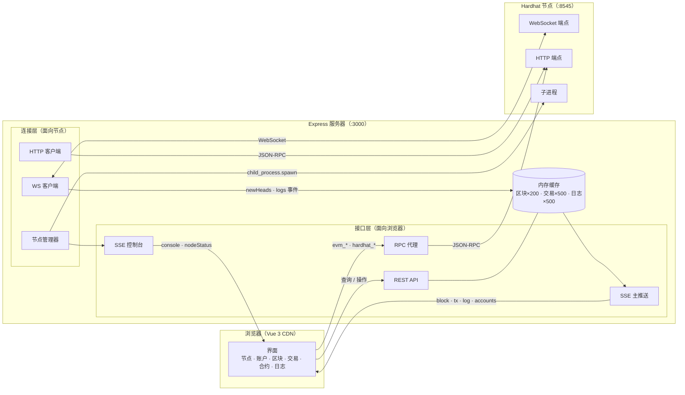
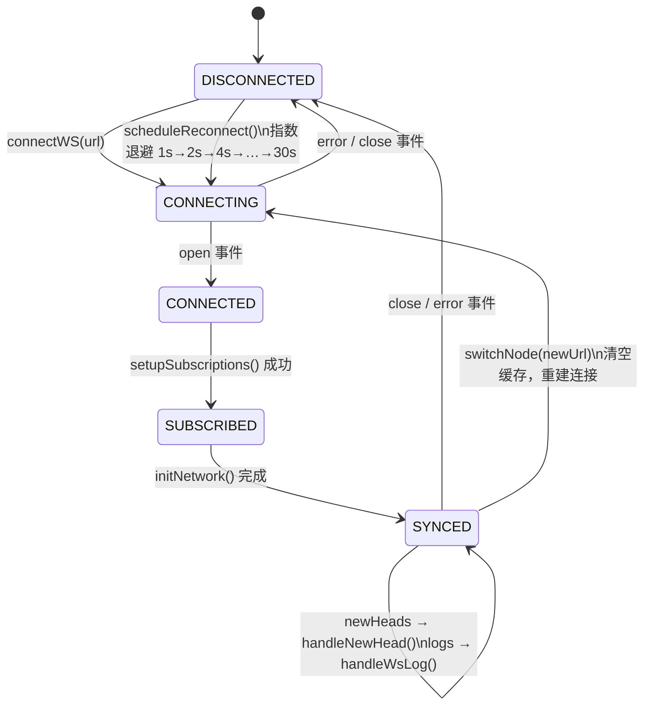
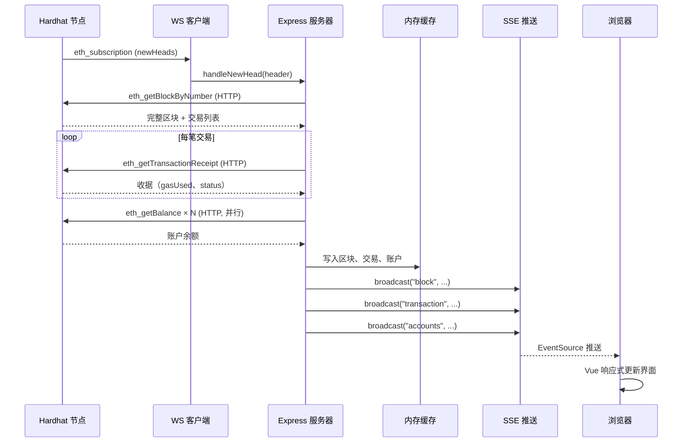

# Hardhat GUI

**中文** | [English](README.en.md)

Hardhat 本地节点的可视化管理界面，功能对标 Ganache，提供全中文界面，通过浏览器访问。

> 内置 Hardhat，无需外部项目，无需构建工具，一条命令启动。

---

## 为什么需要 Hardhat GUI？

### Ganache / Truffle 已成历史

Ganache 曾是以太坊本地开发的标配工具，提供了直观的桌面 GUI，让开发者无需命令行即可管理账户、查看区块和调试交易。然而，**Truffle Suite（含 Ganache）已于 2023 年 9 月正式宣布停止维护**，官方建议迁移到 Hardhat 或 Foundry。Ganache 的最后一个正式版本停留在 2022 年，此后不再修复漏洞或适配新版 Node.js，在现代开发环境中已难以正常运行。

### Hardhat 功能强大，但只有命令行

Hardhat 是目前最活跃的以太坊开发框架，内置本地节点（基于 EDR/Rust 核心）、强大的调试能力和丰富的插件生态。然而，**Hardhat 官方从未提供 GUI 界面**——所有操作均通过命令行完成，区块、交易、账户状态散落在终端输出中，缺乏可视化的全局视图。这对习惯 Ganache 的开发者、教学场景或需要向非技术人员演示的情况，构成了明显的使用门槛。

### 现有替代方案的局限

| 工具 | 问题 |
|------|------|
| Ganache Desktop | 停止维护，Node.js 兼容性差，不支持 Hardhat v3 |
| Ganache CLI | 同上，已归档，不再更新 |
| Otterscan | 需要独立部署，面向生产链，对本地开发节点支持有限 |
| Remix IDE | 功能覆盖有限，无本地节点管理，无完整交易历史 |
| Blockscout | 基础设施复杂，本地部署成本高 |

### Hardhat GUI 的定位

本项目填补了这一空白：**专为 Hardhat 本地节点量身打造的轻量级可视化管理界面**。

- 无需安装桌面应用，浏览器即开即用
- 内置 Hardhat，一条命令完成环境搭建
- 实时可视化账户、区块、交易、合约和链上日志
- 支持 Fork 主网、快照回滚、时间快进等高级调试功能
- 全中文界面，降低学习和教学成本

---

## 功能概览

| 标签页 | 主要功能 |
|--------|---------|
| **节点** | 在 GUI 内启动/停止 Hardhat 节点；配置端口、Chain ID、账户、助记词、Fork；实时控制台输出 |
| **账户** | 地址、ETH 余额、Nonce；点击展开显示/复制私钥 |
| **区块** | 实时追加新区块；展开查看区块内所有交易 |
| **交易** | 全量交易记录；展开查看 Input Data、Gas 详情、合约创建地址 |
| **合约** | 自动扫描 `artifacts/` 目录，展示完整 ABI 结构 |
| **日志** | WebSocket 订阅实时接收链上事件日志 |

工具栏：手动出块、自动出块开关、时间快进、网络快照与回滚。

---

## 界面截图

### 账户管理



### 区块浏览



### 交易记录



### 合约 ABI 浏览



### 事件日志



### 节点管理



### 快照与回滚



---

## 环境要求

| 依赖 | 版本要求 |
|------|---------|
| Node.js | >= 22.4.0（内置 `fetch` 和 `WebSocket`） |

无需单独安装 Hardhat，已作为内置依赖包含在本项目中。

---

## 快速开始

```bash
# 1. 安装依赖
npm install

# 2. 启动 GUI 服务
npm start

# 3. 浏览器访问
# http://localhost:3000
```

打开页面后，切换到「节点」标签页，点击「▶ 启动节点」即可。

---

## 目录结构

```
hardhat-gui/
├── server.js            # Express 后端（WS 连接 + SSE 推送 + REST API）
├── package.json
├── node-workspace/      # 运行时生成（已加入 .gitignore）
│   ├── package.json     # { "type": "module" }
│   └── hardhat.config.js  # 由 GUI 配置动态生成
└── public/
    ├── index.html       # 单页应用入口（Vue 3 CDN）
    ├── app.js           # Vue 3 应用逻辑
    └── style.css        # 暗色主题样式
```

---

## 环境变量

| 变量名 | 默认值 | 说明 |
|--------|--------|------|
| `PORT` | `3000` | GUI 服务端口 |
| `RPC_URL` | `http://127.0.0.1:8545` | 启动时连接的节点地址 |
| `ARTIFACTS_DIR` | `../dapp/artifacts` | 合约 artifacts 扫描目录 |

```bash
# 连接已有节点（跳过内置节点管理）
RPC_URL=http://127.0.0.1:8546 npm start

# 指定合约目录
ARTIFACTS_DIR=/path/to/project/artifacts npm start
```

---

## 功能详解

### 节点管理

GUI 内置完整的节点生命周期管理，无需手动在命令行操作。

**基础配置：**

| 配置项 | 说明 |
|--------|------|
| Hardhat 项目目录 | 留空使用内置 Hardhat；填写路径可加载外部项目的合约 artifacts |
| 监听端口 | 默认 8545 |
| 监听地址 | 默认 127.0.0.1 |
| Chain ID | 默认 31337 |

**账户配置（折叠）：**

| 配置项 | 说明 |
|--------|------|
| 账户数量 | 默认 20 |
| 初始余额 | 单位 ETH，默认 10000 |
| 助记词 | 默认 Hardhat 标准助记词 |

**Fork 配置（折叠）：**

| 配置项 | 说明 |
|--------|------|
| Fork 源 RPC URL | 填写后节点将 fork 指定链（如 Mainnet、Sepolia） |
| Fork 起始区块 | 留空则 fork 最新区块 |

节点启动后，右侧控制台实时显示 stdout/stderr 输出，左侧展示已解析的账户地址与私钥。

**实现原理：**

- 通过 `child_process.spawn` 启动 `hardhat node` 子进程
- 动态生成 `node-workspace/hardhat.config.js`（纯对象导出，无外部 import）
- Windows 下通过 `taskkill /F /T /PID` 清理进程树

### 账户

- 列出节点所有账户，每个新区块后自动刷新余额和 Nonce
- 点击任意行展开，可显示/隐藏对应私钥
- Hardhat 默认助记词（`test test test ... junk`）生成的 20 个账户私钥自动匹配；自定义账户显示"私钥未知"
- 支持一键复制地址和私钥

### 区块

- 按时间倒序展示，新区块通过 WebSocket 事件实时追加（延迟 < 10ms）
- 每行：区块号、时间、交易数、Gas 使用量/限制、区块哈希
- 点击展开：父哈希、矿工地址、区块内所有交易概要
- 支持分页浏览历史区块

### 交易

- 记录所有交易，每个新区块后实时推送至前端
- 每行：交易哈希、区块号、发送方、接收方、金额、Gas 消耗、执行状态
- 点击展开：完整字段（Gas 价格、Nonce、合约创建地址、Input Data 原始数据）
- 支持分页浏览

### 合约

- 自动扫描配置的 `artifacts` 目录，识别所有已编译合约（跳过 `build-info` 和 `.dbg.json`）
- 左侧列表：合约名称、成员数量、字节码大小
- 右侧详情：完整 ABI，含函数签名、参数类型、可见性、返回值类型
- 可输入已部署地址便于核对
- 支持自定义扫描目录

**ABI 成员类型：**

| 标签 | 含义 |
|------|------|
| 函数 | function |
| 事件 | event |
| 构造 | constructor |
| 接收 | receive |
| 回退 | fallback |
| 错误 | error（自定义错误） |

### 日志

- 通过 `eth_subscribe("logs", {})` 直接接收链上事件，无需遍历收据
- 每条记录：区块号、合约地址、来源交易哈希、Topics 列表、Data
- 支持手动清空

### 工具栏

| 控件 | 对应 RPC | 说明 |
|------|----------|------|
| ⛏ 出块 | `evm_mine` | 立即挖出一个空区块 |
| 自动出块 | `evm_setAutomine` | 开启时每笔交易立即出块 |
| 📸 快照 | `evm_snapshot` / `evm_revert` | 保存/回滚链状态 |
| ⏩ 时间 | `evm_increaseTime` | 快进区块时间戳 |

---

## 技术架构

### 系统架构图



### WebSocket 连接状态机



### 新区块数据流



**后端连接层（WS）：**

| 函数 | 职责 |
|------|------|
| `connectWS(url)` | 建立连接，注册消息/关闭/错误监听 |
| `setupSubscriptions()` | 订阅 `newHeads` + `logs`，成功后调 `initNetwork()` |
| `initNetwork()` | HTTP 拉取 chainId / 账户 / 补全遗漏区块，广播初始状态 |
| `handleNewHead(header)` | 新块头到达 → HTTP 补全完整区块 → 广播 |
| `handleWsLog(log)` | 日志直接推送 → 去重 → 广播 |
| `scheduleReconnect()` | 指数退避（1→2→4→…→30s） |
| `switchNode(httpUrl)` | 切换节点：清缓存 + 重建 WS 连接 |

**特殊操作处理：**

| 操作 | 处理方式 |
|------|---------|
| `evm_mine` | WS `newHeads` 自动触发，无需额外处理 |
| `evm_revert` | 不产生 WS 事件，手动清空缓存后调 `initNetwork()` 重新同步 |
| `hardhat_reset` | 清空缓存后调 `initNetwork()`，WS 订阅保持有效 |
| 节点切换 | `switchNode()` 取消重连计划、清缓存、建立新 WS 连接 |

**前端（Vue 3 CDN）：**

- Options API，无构建步骤
- 主 SSE：接收区块/交易/日志/网络状态实时推送
- 节点 SSE：接收控制台输出和节点状态变化
- REST API：历史数据分页、EVM 控制操作

**内存缓存上限：**

| 类型 | 上限 |
|------|------|
| 区块 | 200 个 |
| 交易 | 500 笔 |
| 事件日志 | 500 条 |

---

## 支持的 RPC 方法

工具栏通过白名单代理调用以下 Hardhat 专有方法：

| 方法 | 用途 |
|------|------|
| `evm_mine` | 手动出块 |
| `evm_setAutomine` | 设置自动出块开关 |
| `evm_setIntervalMining` | 设置固定间隔出块（毫秒） |
| `evm_increaseTime` | 快进时间（秒） |
| `evm_setNextBlockTimestamp` | 设置下一个区块的精确时间戳 |
| `evm_snapshot` | 创建链状态快照，返回快照 ID |
| `evm_revert` | 回滚到指定快照 |
| `hardhat_reset` | 重置网络到初始状态 |
| `hardhat_getAutomine` | 查询当前自动出块状态 |
| `hardhat_setBalance` | 设置账户余额 |
| `hardhat_impersonateAccount` | 模拟账户 |

---

## 开发模式

```bash
npm run dev   # 使用 Node.js --watch，修改 server.js 后自动重启
```

---

## 常见问题

**Q：打开页面显示"未连接"，没有启用内置节点？**

切换到「节点」标签页，点击「▶ 启动节点」。若需连接已有外部节点，用环境变量指定地址：

```bash
RPC_URL=http://127.0.0.1:8545 npm start
```

---

**Q：节点启动失败，控制台报错？**

常见原因：
- 端口已被占用 → 修改「节点配置」中的端口号
- `node-workspace/` 权限问题 → 确认当前用户对项目目录有写权限

---

**Q：合约页面扫描不到合约？**

先在 Hardhat 项目中编译：

```bash
npx hardhat compile
```

然后在「合约」标签页的路径输入框填入 `artifacts` 目录的绝对路径，点击「扫描」。

---

**Q：账户显示"私钥未知"？**

GUI 仅对 Hardhat 默认助记词（`test test test test test test test test test test test junk`）自动匹配私钥。使用自定义助记词时，私钥可在节点标签页的控制台输出中查看。

---

**Q：快照回滚后数据没有更新？**

回滚操作会自动触发 `initNetwork()` 重新同步。若仍有异常，手动刷新浏览器页面。

---

**Q：如何连接 Anvil（Foundry）？**

Anvil 兼容 Hardhat JSON-RPC，WS 订阅同样支持：

```bash
RPC_URL=http://127.0.0.1:8545 npm start
```

---

**Q：Node.js 版本低于 22.4.0 能否使用？**

内置 `WebSocket` 需要 Node.js >= 22.4.0。低版本可安装 `ws` 包后修改 `server.js` 中的 WS 初始化方式，其余逻辑不变。

---

## 注意事项

- 本工具仅用于**本地开发和教学**，请勿连接公共网络或主网节点
- 账户私钥为 Hardhat 测试账户的公开私钥，**不得用于存储真实资产**
- 所有数据存储在内存中，GUI 服务重启后历史记录清空
- `node-workspace/` 目录由程序自动管理，请勿手动修改其中文件
